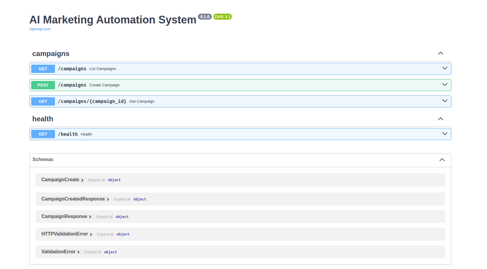

<div align="center">

# 🚀 AI Marketing Automation System

**Create, schedule, and auto-dispatch AI-generated marketing campaigns — text, image, and SMS — from a single FastAPI backend.**

[](https://www.python.org/)
[](https://fastapi.tiangolo.com/)
[](https://www.sqlalchemy.org/)
[](https://www.sqlite.org/)
[](https://docs.pydantic.dev/)
[](https://github.com/astral-sh/uv)

</div>

---

## 📖 Overview

The **AI Marketing Automation System** is a backend service for running marketing campaigns end to end. You create a campaign with a prompt, a phone number, and a scheduled time — the system then **generates marketing copy and a promotional image from the prompt** and **automatically dispatches the message** (simulated SMS) the moment the campaign is due.

It ships with a **pluggable AI-provider layer** (OpenAI, Google Gemini, Anthropic Claude) selected entirely through environment variables, and a **deterministic mock fallback** so the project runs out of the box with **zero API keys** and never blocks on a provider outage.

> Built with a clean, object-oriented, service-based architecture — designed to be readable, testable, and easy to extend.

---

## ✨ Key Features

- 🧠 **Pluggable AI text generation** — OpenAI (GPT), Google Gemini, or Anthropic Claude, switchable via `.env` with **no code changes**.
- 🎨 **Real image generation** — OpenAI (`gpt-image`) or Gemini (Imagen); images are stored locally and served by the app.
- 🛟 **Resilient by design** — missing key, unavailable SDK, or a live API failure transparently falls back to a deterministic mock, so dispatch never breaks.
- ⏰ **Background scheduler** — an async polling loop checks for due campaigns and dispatches them automatically.
- 📦 **Persistent storage** — campaigns stored in SQLite via SQLAlchemy, with full lifecycle (`pending → sent`).
- 📱 **Simulated SMS delivery** — console-based, matching a real provider's message format.
- ✅ **Input validation & error handling** — Pydantic schemas, proper HTTP status codes (`201`, `404`, `422`).
- 📝 **Structured logging** — campaign creation, scheduler runs, provider calls, dispatch, and errors.
- 🔌 **Self-documenting API** — interactive Swagger UI at `/docs`.

---

## 🧰 Tech Stack

| Layer | Technology |
| --- | --- |
| **Language** | Python 3.11+ |
| **Web framework** | FastAPI + Uvicorn (ASGI) |
| **Database** | SQLite + SQLAlchemy 2.0 ORM |
| **Config / validation** | Pydantic v2 + pydantic-settings |
| **AI providers** | OpenAI · Google Gemini (`google-genai`) · Anthropic Claude |
| **Scheduling** | Native `asyncio` polling loop |
| **Tooling** | `uv` (dependency & venv management) |
| **Packaging / Deploy** | Docker (recipe included) |

---


## 📂 Folder Structure

```
.
├── app/
│   ├── api/
│   │   └── campaigns.py              # Campaign REST endpoints
│   ├── models/
│   │   └── campaign.py               # SQLAlchemy Campaign model
│   ├── schemas/
│   │   └── campaign.py               # Pydantic request/response schemas
│   ├── services/
│   │   ├── text_generator.py         # Delegates to the active text provider
│   │   ├── image_generator.py        # Delegates to the active image provider
│   │   ├── sms_service.py            # Console-based SMS simulation
│   │   ├── scheduler_service.py      # Async polling + dispatch pipeline
│   │   └── providers/                # Pluggable AI provider layer
│   │       ├── base.py               # AIProvider interface + shared prompts
│   │       ├── factory.py            # Selects text provider (AI_PROVIDER)
│   │       ├── mock_provider.py      # Deterministic text mock / fallback
│   │       ├── openai_provider.py    # OpenAI text (GPT)
│   │       ├── gemini_provider.py    # Gemini text
│   │       ├── claude_provider.py    # Claude text
│   │       ├── image_base.py         # ImageProvider interface + local storage
│   │       ├── image_factory.py      # Selects image provider (IMAGE_PROVIDER)
│   │       ├── mock_image_provider.py
│   │       ├── openai_image_provider.py
│   │       └── gemini_image_provider.py
│   ├── database/
│   │   └── database.py               # Engine, session, init
│   ├── core/
│   │   └── logging_config.py         # Centralized logging
│   ├── config.py                     # Env-based settings
│   └── main.py                       # App entry point + static mount
├── .env.example
├── pyproject.toml
└── README.md
```

---

## ⚙️ Installation

> **Prerequisite:** Python **3.11+**

### Option 1 — using `uv` (recommended)

```bash
uv sync
source .venv/bin/activate          # Windows: .venv\Scripts\activate
```

### Option 2 — using `pip`

```bash
python -m venv .venv
source .venv/bin/activate          # Windows: .venv\Scripts\activate
pip install fastapi "uvicorn[standard]" sqlalchemy pydantic-settings \
            openai google-genai anthropic httpx
```

---

## 🔐 Environment Variables

The app runs with **no configuration at all** (defaults to the mock provider). To enable a real provider, copy the example file and fill in the keys:

```bash
cp .env.example .env
```

```ini
# Active text provider: mock | openai | gemini | claude
AI_PROVIDER=mock

# OpenAI (GPT)
OPENAI_API_KEY=
OPENAI_MODEL=gpt-4o-mini

# Google Gemini
GEMINI_API_KEY=
GEMINI_MODEL=gemini-2.0-flash

# Anthropic Claude
ANTHROPIC_API_KEY=
ANTHROPIC_MODEL=claude-opus-4-8

# Image generation (defaults to AI_PROVIDER; "claude" has no image API → mock)
IMAGE_PROVIDER=
OPENAI_IMAGE_MODEL=gpt-image-1
GEMINI_IMAGE_MODEL=imagen-3.0-generate-002

# Where generated images are stored and the base URL they are served from
IMAGE_STORAGE_DIR=generated_images
PUBLIC_BASE_URL=http://127.0.0.1:8000
```

### Provider selection at a glance

| `AI_PROVIDER` | Text | `IMAGE_PROVIDER` | Image |
| --- | --- | --- | --- |
| `mock` *(default)* | Deterministic template | *(unset → mock)* | Mock URL |
| `openai` | GPT (`gpt-4o-mini`) | `openai` | `gpt-image-1` → real PNG |
| `gemini` | Gemini Flash | `gemini` | Imagen → real PNG |
| `claude` | Claude (`claude-opus-4-8`) | — | **Mock** (Claude has no image API) |

> 💡 **Switching providers is a `.env` change only — never a code change.** Any provider error (bad key, quota, network) automatically falls back to the mock, so the service stays up.

---

## ▶️ Running the Project

### Local (development)

```bash
uv run uvicorn app.main:app --reload
# or, with pip:  uvicorn app.main:app --reload
```

| Resource | URL |
| --- | --- |
| API base | `http://127.0.0.1:8000` |
| Swagger UI | `http://127.0.0.1:8000/docs` |
| ReDoc | `http://127.0.0.1:8000/redoc` |

A SQLite database (`marketing.db`) is created automatically on first run. The scheduler polls every **10 seconds**; when a campaign is due, you'll see:

```text
Sending marketing message to 01913828774
Campaign: AI Course Launch
Generated Text: 🚀 Unlock the future with our new AI course — enroll today!
Generated Image: http://127.0.0.1:8000/images/ai-course-launch-8c64b479.png
```

### Production

Run a **single** process (the in-process scheduler must not be replicated across workers, or campaigns would dispatch more than once), behind a reverse proxy:

```bash
uvicorn app.main:app --host 0.0.0.0 --port 8000
```

> For horizontal scaling, externalize the scheduler (e.g. Celery beat / APScheduler with a shared DB lock) and move storage to PostgreSQL — see [Future Improvements](#-future-improvements).

---

## 🔌 API Overview

Base path: `/campaigns`

| Method | Endpoint | Description | Success | Errors |
| --- | --- | --- | --- | --- |
| `POST` | `/campaigns` | Create & store a campaign | `201` | `422` (validation) |
| `GET` | `/campaigns` | List all campaigns | `200` | — |
| `GET` | `/campaigns/{id}` | Fetch a single campaign | `200` | `404` |

<details>
<summary><b>Create a campaign</b></summary>

```bash
curl -X POST http://127.0.0.1:8000/campaigns \
  -H "Content-Type: application/json" \
  -d '{
    "campaign_name": "AI Course Launch",
    "prompt": "Promote our new AI course",
    "phone": "01913828774",
    "schedule_time": "2026-06-15 10:00:00"
  }'
```

```json
{ "message": "Campaign created successfully" }
```
</details>

<details>
<summary><b>Get a single campaign</b></summary>

```bash
curl http://127.0.0.1:8000/campaigns/1
```

```json
{
  "id": 1,
  "campaign_name": "AI Course Launch",
  "prompt": "Promote our new AI course",
  "phone": "01913828774",
  "schedule_time": "2026-06-15T10:00:00",
  "generated_text": "🚀 Unlock the future with our new AI course...",
  "generated_image_url": "http://127.0.0.1:8000/images/ai-course-launch-8c64b479.png",
  "status": "sent"
}
```
</details>

---

## 🐳 Deployment Guide

The project ships fully containerized — a multi-stage `Dockerfile` (slim runtime, non-root user, ~350 MB) and two Compose files:

| File | Purpose |
| --- | --- |
| `Dockerfile` | Multi-stage build; runs Gunicorn + Uvicorn worker |
| `docker-compose.yml` | **Development** — builds locally, hot-reload, mounted source |
| `docker-compose.prod.yml` | **Production** — pulls the prebuilt image from Docker Hub |
| `.dockerignore` | Keeps secrets, local DB, venv, and images out of the build context |

> ⚠️ The container runs a **single worker on purpose** — the in-process scheduler must not be replicated, or campaigns dispatch multiple times. Persistent data (SQLite DB + generated images) lives under `/app/data`, backed by a named volume.

### 1. Local development

```bash
docker compose up --build        # http://localhost:8000
```

### 2. Build & push to Docker Hub

```bash
# Build (use --platform linux/amd64 if building on Apple Silicon for an x86 EC2 host)
docker build -t fahad1000mir/ai-marketing-automation:latest .

docker login
docker push fahad1000mir/ai-marketing-automation:latest
```

### 3. Deploy on AWS EC2

On the server you only need **two files**: `docker-compose.prod.yml` and `.env`.

```bash
# 1. Install Docker + Compose plugin (Amazon Linux 2023)
sudo dnf install -y docker && sudo systemctl enable --now docker

# 2. Copy docker-compose.prod.yml and .env to the instance, then:
docker compose -f docker-compose.prod.yml pull
docker compose -f docker-compose.prod.yml up -d

# 3. Verify
curl http://localhost:8000/health        # {"status":"ok"}
docker compose -f docker-compose.prod.yml logs -f
```

Open port **8000** in the instance's security group. In `.env`, set
`PUBLIC_BASE_URL=http://<EC2_PUBLIC_IP>:8000` so generated image URLs resolve
externally. To ship a new version: rebuild → push → `pull` → `up -d` on EC2.

### Production notes

- **Persistence:** the `app_data` named volume holds `marketing.db` and `generated_images/` across restarts. Back up the volume, or move to managed Postgres + S3 for scale.
- **Reverse proxy / TLS:** front the container with Nginx, Caddy, or an ALB to terminate HTTPS.
- **CI/CD:** a GitHub Actions pipeline can lint, test, `docker build`, and push to Docker Hub on each tag — then trigger the `pull && up -d` on the host.

---

## 🖼️ Screenshots


| Swagger UI (`/docs`) |
 
|  |
---

## 🗺️ Future Improvements

- [ ] Automated test suite (unit + integration) and GitHub Actions CI.
- [ ] PostgreSQL + Alembic migrations for production-grade persistence.
- [ ] Distributed/locked scheduler (Celery beat / APScheduler) for multi-instance scaling.
- [ ] Real SMS delivery via Twilio / Vonage behind a `SMSProvider` interface.
- [ ] Cloud object storage (S3/GCS) for durable, public image URLs.
- [ ] Authentication & rate limiting on the API.
- [ ] Campaign update/cancel endpoints and pagination on list.

---

## 👤 Author

**Md Fahad Mir**

[](https://github.com/Md-Fahad-Mir)
[](https://linkedin.com/in/md-fahad-mir)
[](mailto:fahad1000mir@gmail.com)


---


⭐ If you find this project useful, consider giving it a star!

</div>
